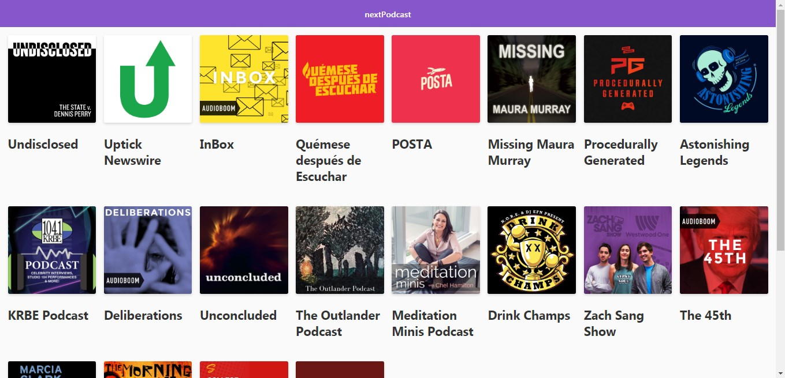
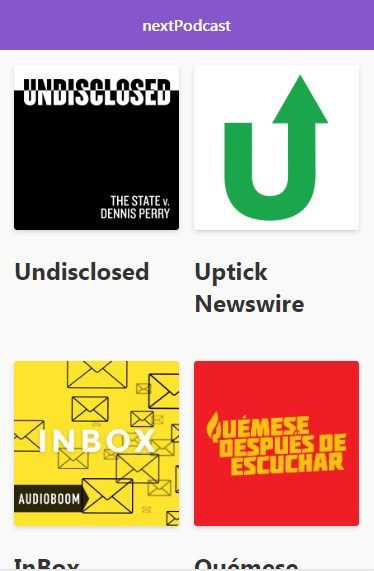

# Podcasts App

## Description

Podcast App integrated with AudioBoom API developed with Next.js

[Live Demo](https://podcasts-tzfafutwzr.now.sh)

## How it works?

Require Node.js 10

* `npm install` Install dependencies.
* `npm run dev` Development environment.
* `npm run build && npm start` Production environment.

## License

MIT